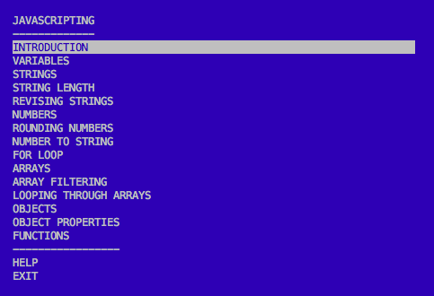

# JAVASCRIPTING (Tiếng Việt)

> Học JavaScript qua các bài tập tương tác trong terminal.

> _Tìm thêm tutorial tương tự? Xem [nodeschool.io](http://nodeschool.io)._

## Cài đặt Node.js

Cần cài Node.js trên máy.

Tải từ [nodejs.org](https://nodejs.org/)

## Cài đặt từ source (local)

Clone repo và cài global từ mã nguồn:

```bash
git clone https://github.com/workshopper/javascripting.git
cd javascripting
npm install
npm link
```

Lệnh `npm link` cài workshop globally để chạy lệnh `javascripting` ở bất kỳ thư mục nào.

Không dùng `npm link`? Chạy trực tiếp:

```bash
node bin/javascripting
```

## Chạy workshop

Mở terminal và chạy:

```
javascripting
```

Bạn sẽ thấy menu bằng **tiếng Việt** (ngôn ngữ mặc định của fork này).



Dùng phím ↑ ↓ để di chuyển, Enter để chọn bài.

### Chuyển ngôn ngữ

Trong menu chọn **CHỌN NGÔN NGỮ** → **Vietnamese (Tiếng Việt)** hoặc **English**.

Nếu menu vẫn tiếng Anh (do đã lưu preference cũ), chọn lại ngôn ngữ hoặc xóa file cấu hình:

```bash
rm -rf ~/.config/javascripting ~/.config/workshopper
```

### Làm bài và verify

1. Chọn bài từ menu
2. Tạo file `.js` theo hướng dẫn
3. Kiểm tra bài làm:

```
javascripting verify ten-file.js
```

> **Lưu ý CLI:** Lệnh `javascripting select` cần tên bài nội bộ (ví dụ `INTRODUCTION`), không phải tên tiếng Việt trên menu. Dùng menu tương tác (↑↓ + Enter) để chọn bài bình thường.

Ví dụ bài đầu:

```bash
mkdir javascripting && cd javascripting
touch introduction.js
# thêm console.log('hello') vào file
javascripting verify introduction.js
```

## Trợ giúp

Gặp vấn đề? Xem [nodeschool discussions](https://github.com/nodeschool/discussions) hoặc [issues](https://github.com/workshopper/javascripting/issues).

Tài liệu troubleshooting: [TROUBLESHOOTING.md](https://github.com/workshopper/javascripting/blob/master/TROUBLESHOOTING.md)

## Đóng góp

Mọi đóng góp đều welcome! Xem [CONTRIBUTING.md](https://github.com/workshopper/javascripting/blob/master/CONTRIBUTING.md).

Hướng dẫn thêm bản dịch: [LOCALIZING.md](LOCALIZING.md)

## License

MIT
